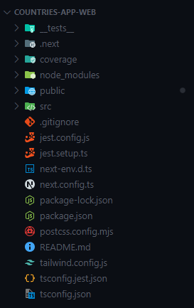
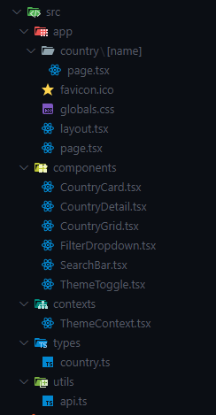
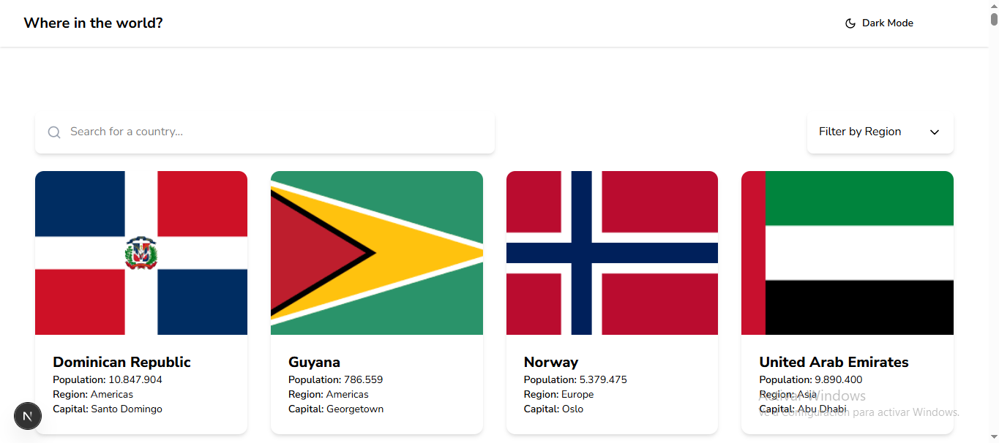
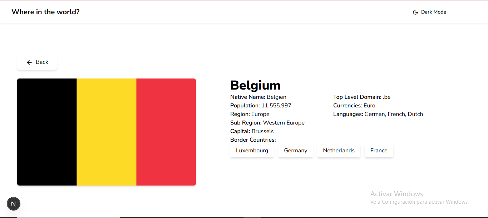
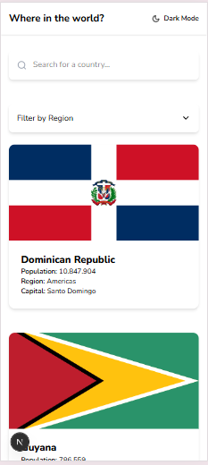
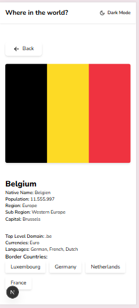
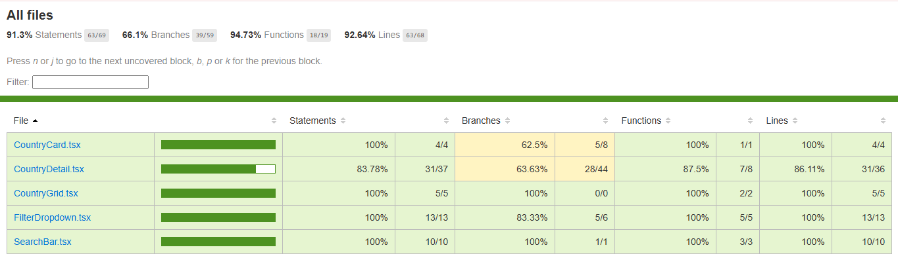

# Countries App Web

Aplicación web construida con **Next.js**, **React**, y **Tailwind CSS**, que permite consultar, buscar y explorar información de todos los países del mundo utilizando la API pública de [REST Countries](https://restcountries.com/).

---

## Descripción del Proyecto

Este reto técnico consistía en desarrollar una aplicación web que permita a los usuarios:

- Buscar países por nombre.
- Filtrar por región.
- Visualizar información relevante de cada país.
- Ver detalles completos y países fronterizos.

El objetivo era entregar una solución escalable, mantenible, responsive y con pruebas unitarias.

---

## Arquitectura Propuesta

### Visión General

Se utilizó una arquitectura modular con separación clara de responsabilidades. El stack se basa en el enfoque App Router de Next.js para organizar vistas y componentes.

### Estructura del Proyecto

Estructura general de carpetas:



Estructura carpeta src:



### Componentes Principales

- `CountryCard.tsx`: Tarjeta individual de país.
- `CountryGrid.tsx`: Grilla con múltiples países.
- `CountryDetail.tsx`: Vista de detalle de país.
- `SearchBar.tsx`: Barra de búsqueda.
- `FilterDropdown.tsx`: Filtro por región.

### Patrones de diseño

- **Component-Based Architecture (React)**
- **Separation of Concerns (SoC)**
- **Client Component** para detalle (mejora UX)
- **Repository + Utility pattern** para el acceso a la API.

---

## Tecnologías Utilizadas

### Frontend

- React 19
- Next.js 15 (App Router)
- Tailwind CSS 4
- TypeScript 5

### Testing

- Jest
- React Testing Library
- ts-jest
- next-router-mock

### Herramientas y DevOps

- ESLint / Prettier
- GitHub Actions (propuesto para CI/CD)

---

## Instalación y configuración

### Requisitos

- Node.js 18+
- npm o yarn

### Pasos

```bash
# 1. Clona el repositorio
git clone https://github.com/cysorianop/countries-app-web.git
cd countries-app-web

# 2. Instala las dependencias
npm install

# 3. Corre la app
npm run dev

# 4. Ejecuta pruebas
npm run test

# 5. Verifica cobertura
npm run test:coverage

```

---

## Diseño de Referencia

Vista de escritorio paises:



Vista de escritorio detalles paises:



Vista móvil paises:



Vista móvil detalles paises:



## Cómo se resolvió el reto

1. Análisis del problema
       - Se identificaron los requerimientos funcionales: búsqueda, filtros, detalle.
       - Se analizó la API restcountries.com para su estructura de datos.
       - Se diseñó un modelo de datos Country con tipado.

2. Diseño de la solución
       - Se dividió el código en componentes reutilizables.
       - Se definió un archivo utils/api.ts para centralizar el acceso a datos.
       - Se priorizó la experiencia de usuario cargando CountryDetail como componente cliente con loading spinner.

3. Implementación
       - Se construyó siguiendo metodología TDD parcial.
       - Se implementó una grilla responsive con Tailwind.
       - Se realizaron pruebas unitarias con jest y @testing-library/react.

4. Optimizaciones aplicadas
       - Mejora en tiempo de carga cargando el detalle con useEffect.
       - Paralelización de llamadas a API para fronteras.
       - Separación visual progresiva del layout por breakpoint.

---

## Estrategia de Testing
- Pruebas unitarias de todos los componentes clave.

- Componentes testeados:
   * CountryCard, CountryGrid, CountryDetail
   * SearchBar, FilterDropdown

- Cobertura



---

## Cuellos de botella encontrados

# Lenta carga del detalle de país

Problema:
Carga secuencial y SSR bloqueaban el renderizado de la página detalle.

Solución:
Migración del detalle a un componente cliente (use client) con useEffect y loading state, manteniendo UX fluida.

# Recomendaciones futuras
 - Paginación o virtual scroll en listas.
 - Mejora de accesibilidad (etiquetas ARIA).

# Contribución

- Crea una rama: feature/tu-cambio
- Haz tus cambios con tests
- Crea un Pull Request con descripción clara

# Estándares
- Código limpio (Prettier + ESLint)
- Tests obligatorios si se modifica lógica
- Commits descriptivos
